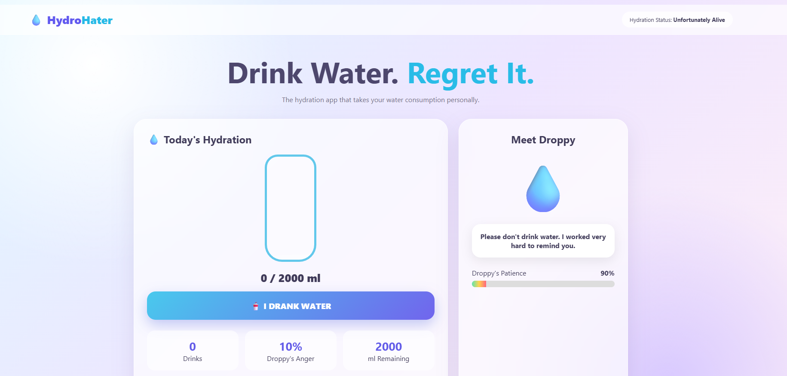
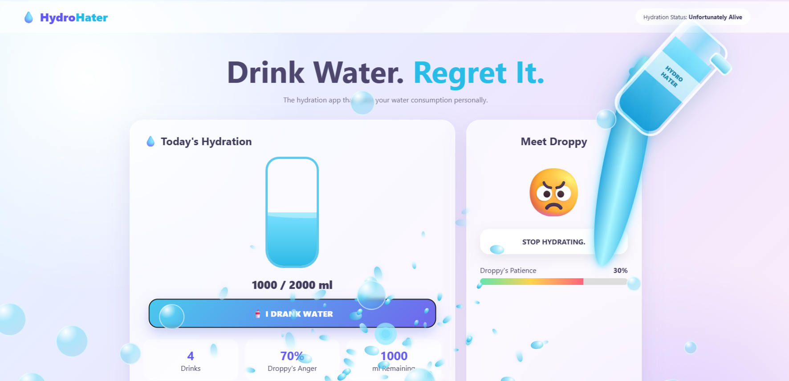

# [Project Name] 🎯

## Basic Details
### Team Name: De-Bug

### Team Members
- Team Lead:  - [College]
- Member 2: Anjitha Biju - Ahalia school of engineering and technology
- Member 3: Ishani Menon - Ahalia school of engineering and technology

### Project Description
The Anti-Hydration Remainder monitors daily water intake through an interactive interface, instead of encouraging users normally .Its virtual character "Droppy" gets annoyed whenever the user drinks water.

### The Problem (that doesn't exist)
solving a boring problem of staying hydrated by making water consumption impossible to ignore and ridiculously entertaining.

### The Solution (that nobody asked for)
By making the remainder so annoying and funny that users actually want to drink water just to see what it does next.

## Technical Details
### Technologies/Components Used
For Software:
- HTML
- [Frameworks used]
- [Libraries used]
-Google Anti-gravity,notepad,web browser 

For Hardware:
- [List main components]
- [List specifications]
- [List tools required]

### Implementation
For Software:
# Installation
1. copy the code into notepad
2. save the file with an ".HTML"extension
# Run
double click the "index.html" file to open and run it directly in any web browser

### Project Documentation
For Software:

# Screenshots (Add at least 3)
![Screenshot1] 

![Screenshot2] 

*Add caption explaining what this shows*

# Diagrams

*Add caption explaining your workflow*

For Hardware:

# Schematic & Circuit

*Add caption explaining connections*

*Add caption explaining the schematic*

# Build Photos

*List out all components shown*

*Explain the build steps*

*Explain the final build*

### Project Demo
# Video
[Add your demo video link here]
*Explain what the video demonstrates*

# Additional Demos
[Add any extra demo materials/links]

## Team Contributions
- [Name 1]: [Specific contributions]
- [Name 2]: [Specific contributions]
- [Name 3]: [Specific contributions]

---
Made with ❤️ at TinkerHub Useless Projects 

